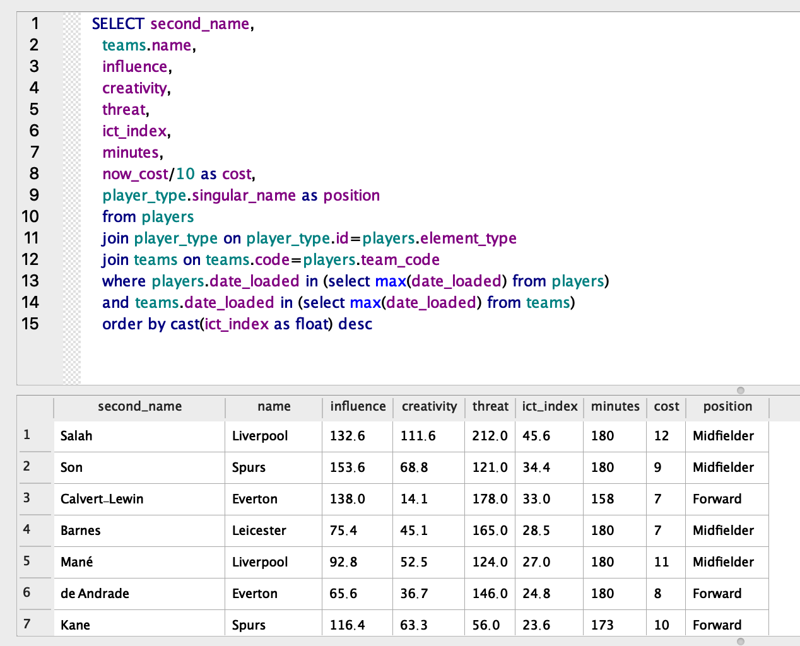

### Fantasy Premier League Database & Analytics

Use conda to create and activate environment

```
conda env create -f environment.yml
conda activate fpl 
```

Based on the available data given by FPL's API you can create a database with information on teams & players. 

```
python src/create_update_db.py
```

First execution of the script will create a SQLite database with the load date as an extra column in all tables needed to keep track of historical data. Script needs to run maximum 1 per day. If scheduled to run more times data for the same day the most recent day's load for all tables will be kept.

You can access the DB with an DB Browser for SQLite and explore or take advantage of the available information for further analysis as seen below. Two queries are included as examples as well as a kmeans script to cluster players by their performance.

```
python src/cluster_players.py
```


